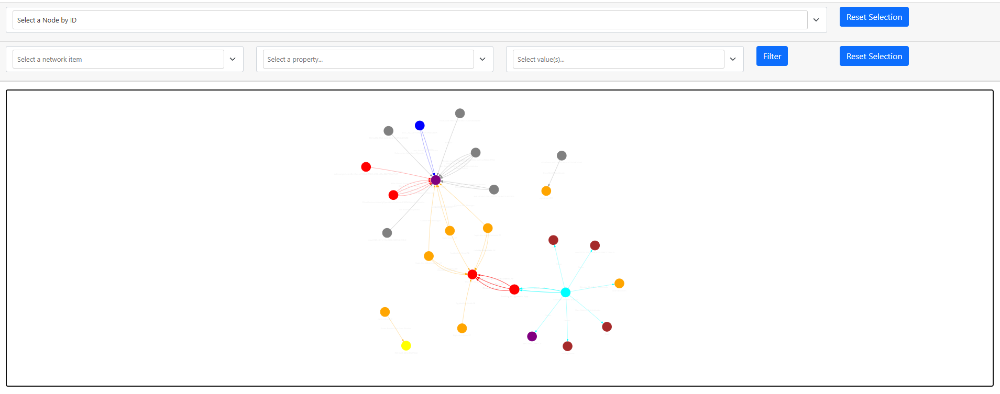

# Azure Role Assignments Auditor
## Overview



This project provides a containerized web application using Pyvis, NetworkX, and FastAPI to audit application role assignments and RBAC role assignments in Azure. The application visualizes role assignments in an interactive network graph, helping security teams analyze access control structures.

### Features
- Interactive role assignment visualization using Pyvis and NetworkX.
- Filtering and searching capabilities to analyze specific role assignments.
- Integration with Microsoft Entra ID (Azure AD) for application and RBAC role audits.

## Permissions
### Required RBAC Permissions in Azure

Your identity must have one of these roles at the subscription level:
- Reader → Can only view roles, not assign them.
- Security Reader → Can view roles and security configurations.
- User Access Administrator → Can view and manage role assignments.
- Owner → Has full access, including changes to RBAC.

**Note:** At a minimum, Reader is required to fetch data.

### Required Microsoft Entra ID (Azure AD) Permissions

The identity running the API (user or Service Principal) must be assigned the following API permissions:
- Application.Read.All → To list service principals.
- AppRoleAssignment.Read.All → To view application role assignments.

## Disclaimer

This project is provided "as is" without any warranties, express or implied. The authors and contributors are not responsible for any security risks, misconfigurations, or unintended consequences resulting from the use of this tool. Use it at your own risk and ensure compliance with your organization's security policies and Microsoft's terms of service.

## Installation
### Prerequisites
- Azure Subscription with appropriate RBAC permissions.
- Microsoft Entra ID (Azure AD) with API permissions.
- Docker installed on your machine.
- Python 3.8+ (if running locally without Docker).

### Setup

1. Clone the repository:
```bash
git clone https://github.com/sjimenez44/AzureRoleAssignmentAuditor.git
cd AzureRoleAssignmentAuditor
```
2. Run retrieve data:
```bash
python data.py
```
3. Install dependencies and run the app:
```bash
uvicorn app:app --reload
```
4. Access the web UI at: http://localhost:8000

### Node types

| Node Name        | Color  |
|------------------|--------|
| Group            | blue   |
| User             | cyan   |
| Application      | red    |
| ServicePrincipal | gray   |
| ManagementGroup  | brown  |
| Subscription     | purple |
| ResourceGroup    | yellow |
| Resource         | orange |

## Roadmap 
- Dockerfile
- ? (suggestions are welcome)

## Contributing

Pull requests are welcome! Please open an issue for discussions before submitting major changes.
